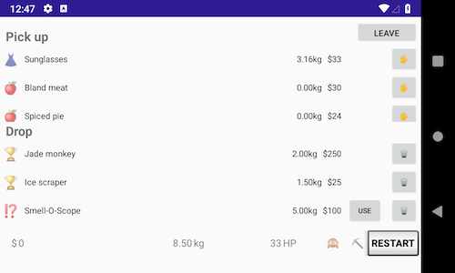

# MADrpg: Android/Kotlin RPG with Android Architecture Components

This repo contains my submission for my Mobile Application Development class in Semester 2 2018.

The assignment goal was to create a simple tile-based game with randomly generated areas and database persistence (full specification [here](assignment-spec.pdf)).

I chose to implement the assignment in Kotlin, following the official Android recommendation of a [MVVM app architecture](https://developer.android.com/jetpack/docs/guide#recommended-app-arch).

Some things you'll find in the code:
* **Room** database interaction
* Players, items, and areas stored in **LiveData** objects
* Fragment/activity updates through **ViewModels**
* **RecyclerView** item lists (with **DiffUtil** to handle updates efficiently)
* At least four major bugs, try to find them all!

At the time of writing this app, there weren't many examples of games using the Android Architecture Components—particularly in Kotlin! The end result is far from perfect, but I hope it's an interesting read for anyone wondering how (not) to implement game functionality in a modern Android app architecture.

